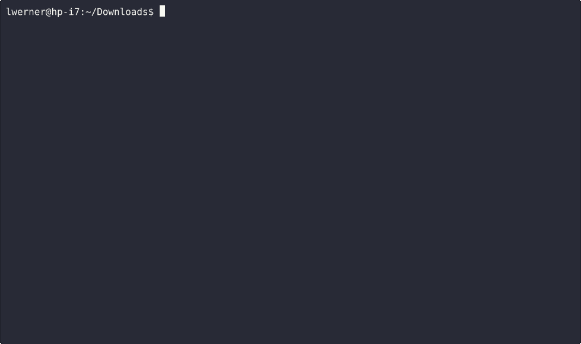
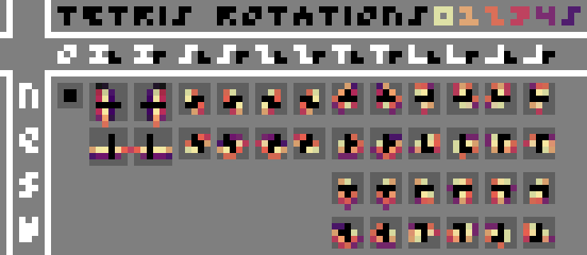
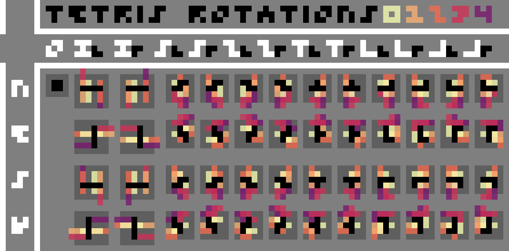

<div align="center"></div>


# Tetromino Game Engine + Playable Terminal Application

This repository hosts:
- `tetrs_terminal`, a simple, polished, efficient, cross-platform TUI implementation of the prototypical singleplayer game experience, and
- `tetrs_engine`, a tetromino game engine implementing an abstract interface with modern mechanics.


## How to run
> Pre-compiled.
> - Download a release for your platform if available and run the application.

> Compiling yourself.
> - Have [Rust](https://www.rust-lang.org/) installed.
> - Download / `git clone` this repository.
> - Navigate to `tetrs_terminal/` and `cargo run`.

> [!NOTE]
> Use a terminal like [kitty](<https://sw.kovidgoyal.net/kitty/>) (or any terminal with [support for progressive keyboard enhancement](https://docs.rs/crossterm/latest/crossterm/event/struct.PushKeyboardEnhancementFlags.html)) for smooth gameplay **controls** and/or visual experience. 
> 
> > <details>
> > 
> > <summary> Explanation. </summary>
> > 
> > Terminals do not usually send "key released" signals, which is a problem for mechanics such as "press left to move left repeatedly **until key is released**".
> > [Crossterm](https://docs.rs/crossterm/latest/crossterm/) automatically detects ['kitty-protocol'-compatible terminals]([https://docs.rs/crossterm/latest/crossterm/event/struct.PushKeyboardEnhancementFlags.html](https://sw.kovidgoyal.net/kitty/keyboard-protocol/#progressive-enhancement)) where this issue is solved.
> > Otherwise DAS/ARR will be determined by Keyboard/OS/terminal emulator settings.
> > *(This also affects Soft Drop, which with kitty can be held with the piece hitting ground without immediately locking piece.)*
> > 
> > </details>


## Gallery




## Features of the Application

**Gamemodes**
- Marathon (reach lvl 20), 40-Lines, Time Trial, Master (20G), Endless.
- Puzzle Mode
  - Find all perfect clears through some [*'ocular' rotation system*](#ocular-rotation-system) piece acrobatics (with one retry per puzzle stage).
- Custom Mode
  - Start level start, toggle level increment, game limit *(Time, Score, Pieces, Lines, Level, or None)*.

**Gameplay**
- Familiar game experience with moving, rotating, hard- and softdropping *tetrominos*.
- Colored pieces (guideline).
- Next piece preview (N=1).
- Ghost piece.
- Animations for: Hard drops, Line clears and Piece locking.
- Current game stats: Level, Score, Lines, Time, Pieces generated.
- For technical details see [Features of the Tetrs Engine](#features-of-the-tetrs-engine).
  
**Scoreboard**
- (stored to / loaded from local *tetrs_terminal_scores.json* if possible).
  
**Settings**
- Tile graphics (colored Unicode <-> oldschool, monochrome ASCII).
- Adjustable render rate and toggleable FPS counter.
- Rotation systems: *Ocular*, *Classic* and *Super*.
- Configurable controls.
  <details>
  
  <summary> Default Game Controls </summary>
  
  | Key | Action |
  | -: | :-: |
  | `A` | Rotate left |
  | `D` | Rotate right |
  | (not set) | Rotate around/180° |
  | `←` | Move left |
  | `→` | Move right |
  | `↓` | Soft drop |
  | `↑` | Hard drop |
  | `Esc` | Pause game |
  | `Ctrl`+`D` | Forfeit game |
  | `Ctrl`+`C` | Exit program |
  
   </details>


## Features of the Tetrs Engine

The frontend application is proof-of-concept;
Ultimately the tetrs engine tries to be modular and shifts the responsibility of detecting player input and chosen time of updates to the client.
Basic interaction with the engine could look like the following:

```rust
// Starting a game.
let game = tetrs_engine::Game::with_gamemode(gamemode, time_started);
// Application loop.
loop {
  // Updating the game with a new button state at a point in time.
  game.update(Some(new_button_state), update_time);
  // Updating the game with *no* change in button state (since the last).
  game.update(None, update_time_2);
  // Retrieving the game state (to render the board, active piece, next pieces, etc.).
  let GameState { board, .. } = game.state();
}
```

<details>

<summary> Using the engine in your rust project </summary>

Adding `tetrs_engine` as a [dependency from git](https://doc.rust-lang.org/cargo/reference/specifying-dependencies.html) to your project:

```toml
[dependencies]
tetrs_engine = { git = "https://github.com/Strophox/tetrs.git" }
```

</details>

<details>

<summary> Game Configuration Aspects </summary>

- Gamemodes: Marathon, Sprint, Ultra, Master; Custom, given a playing limit, start lvl, whether to increment level.
- Rotation Systems: *Ocular Rotation System*, *Classic Rotation System*, *Super Rotation System*.
- Tetromino Generators: *Bag*, *Recency-based*, *Uniformly random*.
- Piece Preview (default N = 1)
- Delayed Auto Shift (default DAS = 200ms)
- Auto Repeat Rate (default ARR = 50ms)
- Soft Drop Factor (default SDF = 15.0)
- Hard drop delay (default at 0.1ms)
- Line clear delay (default at 200ms)
- Appearance Delay (default ARE = 100ms)

Currently, drop delay and lock delay\* *(\*But not total ground time)* are a function of the current level:
- Drop delay (1000ms at lvl 1 to 0.833ms ("20G") at lvl 19).
- 'Timer' variant of Extended Placement Lockdown (step reset); The piece tries to lock every 500ms at lvl 19 to every 150ms at lvl 30, and any given piece may only touch ground for 2250ms in total. See also [Piece Locking](#piece-locking).

</details>

<details>

<summary> Game State Aspects </summary>

- Time: Game time is held abstract as "time elapsed since game started" and is not directly tied to real-world timestamps.
- Game finish: The game knows if it finished, and if session was won or lost. Game Over scenarios are:
  - Block out: newly piece spawn location is occupied.
  - Lock out: a piece was completely locked above the skyline (row 21 and above).
- Event queue: All game events are kept in an internal queue that is stepped through, up to the provided timestamp of a `Game::update` call.
- Buttons pressed state: The game keeps an abstract state of which buttons are currently pressed.
- Board state: Yes.
- Active piece: The active piece is stored as a (tetromino, orientation, position) tuple plus some locking data.
- Next Pieces: Are kept in a queue and can be viewed.
- Pieces played so far: Kept as a stat.
- Lines cleared: <sup>yeah</sup>
- (Speed) Level: Increases every 10 line clears and influences only drop/lock delay.
- Scoring: Line clears trigger a score bonus, which takes into account number of lines cleared, spins, combos, back-to-backs.
  <details>
  
  <summary>Scoring Details and Formula</summary>
  
  ```haskell
  score_bonus = 10
              * (lines ^ 2)
              * (if spin then 4 else 1)
              * (if perfect then 16 else 1)
              * combo
              * maximum [1, backToBack * backToBack]
    where lines = "number of lines cleared simultaneously"
          spin = "piece could not move up when locking occurred"
          perfect = "board is empty after line clear"
          combo = "number of consecutive pieces where line clear occurred"
          backToBack = maximum [1, "number of consecutive line clears where spin, perfect or quadruple line clear occurred"]
  ```
  A table of some bonuses is provided:
  | Score bonus | Action |
  | -: | :- |
  | +10 | Single |
  | +40 | Double |
  | +90 | Triple |
  | +160 | Quadruple |
  | +20 | Single (2.combo) |
  | +30 | Single (3.combo) |
  | +80 | Double (2.combo) |
  | +120 | Double (3.combo) |
  | +40 | ?-Spin Single |
  | +160 | ?-Spin Double |
  | +360 | ?-Spin Triple |

  </details>
  
</details>


<details>

<summary> Game Feedback Aspects </summary>

The game provides some useful feedback events upon every `update`, usually used to correctly implement visual effects:
- *Piece locked down*, *Lines cleared*, *Hard drop*, *Accolade* (score bonus info), *Message* (generic message, currently unused)

</details>

Also see documentation (`cargo doc --open`).


## Project Highlights

While the [2009 Tetris Guideline](https://tetris.wiki/Tetris_Guideline) served as good inspiration, I ended up having a lot of fun researching the variety of details of the game myself (thank you [Tetris Wiki](https://tetris.wiki/) and [HardDrop](https://harddrop.com/wiki)!) and also by asking people (thank you GrBtAce and KonSola5!).

In the following I detail various interesting concepts I tackled on my way to completing this game.


### Tetromino Generation

[Tetromino generators are interesting](https://simon.lc/the-history-of-tetris-randomizers), and a core part of the game.

A trivial generator chooses tetrominos *uniformly at random*.
This already works decent for a playable game.

However, typically players tend to get very frustrated when they don't get "the pieces they need" for a while.
*(\*There's even a term for not getting an `I`-piece for an extended period of time: Drought.)*

In modern games, the *bag-based generation system* is ubiquitous;
The system simply takes all 7 pieces once, hands them out in random order, repeat.

It's quite nice knowing an `I` piece will come after 12 pieces, every time. One may even start strategizing and counting where one bag ends and the next starts.

It also takes a bit of the "fun" out of the randomness.

An alternative that seems to work well is *recency-based generation*:
Remember the last time each piece was generated and when choosing the next one randomly, do so weighted by when each one was last seen so it is more likely to choose a piece not played in a while.

This preserves "possibly complete randomness" in the sense that *any* piece may be generated at any time, while still mitigating droughts.

Unlike bag it possibly provides a more continuous "gut feeling" of what piece(s) might come next, where in bag the order upon refill really *is* completely random.


### Ocular Rotation System

> "[tetris has a great rotation system and is not flawed at all](https://www.youtube.com/watch?v=_qaEknA81Iw)"

— *said no one ever, not even [the creator of Tetris himself](https://youtu.be/6YhkkyXydNI?si=jbVwfNtfl5yFh9Gk&t=674).*

Considering the sheer size of the franchise and range of players coming from all sorts of niches and previous game version the *"Super Rotation System"* [gets its job done](https://www.youtube.com/watch?v=dgt1kWq2_7c)™, but it does not change the fact that it was *the* mechanic I thought about redoing when thinking about this project.

<details>

<summary> Creating a Rotation System ... </summary>

To summarize, my personal problems with SRS were:

- The system is not symmetric.
  - Symmetric pieces can look exactly the same in different rotation states, **[but have different behaviour](https://blog.battlefy.com/how-accidental-complexity-harms-the-tetris-community-93311461b2af)**.
  - Doing rotation, then Mirroring board and piece **≠** Mirroring board and piece, then Doing mirrored rotation.
- It's an [advanced system](https://harddrop.com/wiki/SRS) with things like different rotation points for different purposes, yet it re-uses the *exact same kicks* for 5 out of the 7 pieces, even though they have completely different symmetries.
- <sup>Not a hot take, but some rotations are just *weird* (to be chosen over other possibilities).</sup>
- Piece elevators.

Good criteria for a rotation system I can think of would be:

1. Symmetric rotations if the board and piece were appropriately mirrored.
2. Equal-looking states must have the same behaviour.
3. "Don't overdo it with crazy kicks".
4. (But still allow fun things).

The result of this was the *'Ocular' Rotation System*, which was made by... *looking* at each piece orientation and drawing the most *visually* sensible position(s) for it to land in after rotating.

By overlapping all the kicks that are test in sequential order, one gets a compact heatmap of where the piece will land, going from hottest color (bright yellow) to coldest (dark purple):

<details>

<summary> Ocular Rotation System Heatmap </summary>



</details>

Comparison with SRS:

<details>

<summary> Super Rotation System Heatmap </summary>



</details>

Although one starts to spot vague rotational symmetries as intended), the kicks are "all over the place" and have very lenient vertical range.

</details>

In the end I'm happy with how this custom rotation system turned out.
*(\*E.g. it uses piece symmetries to store only half the kicks.*

On the fun side, *Puzzle Mode* in the frontend application is intended to show off some of the spins possible with this system.
You should try it out; I somehow still managed to include a (decently sensible) *T-Spin Triple!*


### Piece Locking

The mechanic of locking a piece tends to be more complicated than it sounds.

Good criteria for a locking system I can think of would be:

1. Keep players from stalling / force players to make a choice eventually.
2. Give players enough flexibility to manipulate the piece even if it's on the ground.
3. Force players to *react/input faster* on higher levels, as speed is supposed to increase.
4. Implement all these limitations as naturally/simply as possible.

I started researching and deciding which locking system to use.

<details>

<summary> Piece Locking ... </summary>

*Classic lock down* is simple, but if one decreases the lock timer at higher levels (3.) then it might become exceedingly difficult for players to actually have enough time to do adjustments (2.).

<details>

<summary> Classic Lock Down </summary>

> - If the piece touches a surface
>   - start a lock timer of 500ms (\**var with lvl*).
>   - record the lowest y coordinate the piece has reached.
> - If the lock timer runs out, lock the piece immediately as soon as it touches the next surface.
> - If the piece falls below the previously lowest recorded y coordinate, reset lock timer.

</details>

*Infinite lock down* essentially mitigates the flexibility issue by saying, *"if the player manipulated his piece, give him some more time"*. 
It's very simple, but the fact that it lets players stall forever (1.) is less nice.

<details>

<summary> Infinite Lock Down </summary>

> - If the piece touches a surface
>   - start a lock timer of 500ms (\**var with lvl*).
> - If the lock timer runs out, lock the piece immediately as soon as it touches the next surface.
> - If the piece moves/rotates (change in position), reset lock timer ('move reset').

</details>

The standard recommended by the guideline is therefore *extended placement lock down*.

<details>

<summary> Extended Placement Lock Down </summary>

> - If the piece touches a surface
>   - start a lock timer of 500ms (\**var with lvl*).
>   - start counting the number of moves/rotates the player makes.
>   - record the lowest y coordinate the piece has reached.
> - If the piece moves/rotates (change in position), reset lock timer ('move reset').
> - If the number of moves reaches 15, do not reset the lock timer anymore.
> - If the lock timer runs out, lock the piece immediately as soon as it touches the next surface.
> - If the piece falls below the previously lowest recorded y coordinate, reset counted number of moves.

*(\*This probably misses a few edge cases, but you get the gist.)*

</details>

Yeah.

It's pretty flexible (2.) yet forces a decision (1.), but the 'count to 15 moves' part of this lock down seems somewhat arbitrary (4.)
<sup>*(\*Also note that after the 15 moves run out one can still manipulate the piece till lock down.)*</sup>

> **Idea.**
> What if we limit the *total amount of time a piece may touch a surface* (1.) instead of number of moves/rotates (4.), though but at higher levels the piece *attempts* to lock down faster (3.), re-attempting later upon move/rotate;
> This still allows for plenty <sup>*\*technically arbitrarily many*</sup> piece manipulations (2.) while still fulfilling the other points :D

<details>

<summary> Timer Extended Placement Lock Down </summary>

*Let 'ground time' denote the amount of time a piece touches a surface*

> - If the piece touches a surface
>   - start a lock timer of 500ms (\**var with lvl*).
>   - start measuring the ground time.
>   - record the lowest y coordinate the piece has reached.
> - If the piece moves/rotates (change in position), reset lock timer ('move reset').
> - If the lock timer runs out *or* the ground time reaches 2.25s, lock the piece immediately as soon as it touches the next surface.
> - If the piece falls below the previously lowest recorded y coordinate, reset the ground time.

</details>

Nice.
Although now it *may potentially* be abused by players which keep pieces in the air, only to occasionally touch down and reset the lock timer while hardly adding any ground time (note that this problem vanishes at 20G).

A small patch for this is to check the last time the piece touched the ground, and if that was, say, less than 2×(drop delay) ago, then act as if the piece had been touching ground all along. This way the piece is guaranteed to be counted as "continuously on ground" even with fast upward kicks of height ≤ 2.

</details>

In the end, a timer-based extended placement lockdown (+ ground continuity fix) is what I used. I have yet to find a nicer system.


### Gamemodes

One game modeling question that came up early on was, *"what even is the goal of this game?"*

One answer is "to play as long as possible" (maximize time/lines/pieces), another is "to play as well as possible" (score).

Upon looking at how common gamemodes work I found:
- There are several game stats one can keep track of, and
- Commonly found gamemodes can be approximated as a combination of *`(stat which is limited so game can complete)` + `(stat which player aims to optimize)`*.
- 
Examples:
- *'Marathon':* limit Level to 20, try for highest score.
- *'Sprint'* / *'40 lines'*: limit lines to 40, try for lowest time.
- *'Ultra'* / *'Time Trial'*: limit time to 2-3min, try for highest score / most lines.

The real implementation additionally stores the (speed) level to start at, and whether clearing lines increments the level.

> [!NOTE]
> Given one stat, how do we know whether we want to maximize or minimize another arbitrary stat?
> I may be overlooking a simpler pattern, but it seems one can order all stats linearly, and given a stat to be fixed/limited, any other stat is maximized/minimized directly depending on whether it's further down/up the sequence:
> <details>
> 
> <summary>Gamemode Stat Relation Table</summary>
> 
> | name | [finss](https://harddrop.com/wiki/Finesse) | time  | piecs | lines | level | score |
> | ---- | ----- | ----- | ----- | ----- | ----- | ----- |
> |      |  fix  |  MAX  |       |       |       |
> |      |       |       |  MAX  |       |       |
> |      |  fix  |       |       |  MAX  |       |
> |      |  fix  |       |       |       |  MAX  |
> |      |  fix  |       |       |       |       |  MAX
> |      |  MIN  |  fix  |       |       |       |
> |      |       |  fix  |  MAX  |       |       |
> | *'Ultra*' |  |  fix  |       |  MAX  |       |
> |      |       |  fix  |       |       |  MAX  |
> |      |       |  fix  |       |       |       |  MAX
> |      |  MIN  |       |  fix  |       |       |
> |      |       |  MIN  |  fix  |       |       |
> |      |       |       |  fix  |  MAX  |       |
> |      |       |       |  fix  |       |  MAX  |
> |      |       |       |  fix  |       |       |  MAX
> |      |  MIN  |       |       |  fix  |       |
> | *'Sprint'* | |  MIN  |       |  fix  |       |
> |      |       |       |  MIN  |  fix  |       |
> |      |       |       |       |  fix  |  MAX  |
> |      |       |       |       |  fix  |       |  MAX
> |      |  MIN  |       |       |       |  fix  |
> |      |       |  MIN  |       |       |  fix  |
> |      |       |       |  MIN  |       |  fix  |
> |      |       |       |       |  MIN  |  fix  |
> | *'Marathon'* | |     |       |       |  fix  |  MAX
> |      |  MIN  |       |       |       |       |  fix
> |      |       |  MIN  |       |       |       |  fix
> |      |       |       |  MIN  |       |       |  fix
> |      |       |       |       |  MIN  |       |  fix
> |      |       |       |       |       |  MIN  |  fix
> 
> </details>

> So how does 'Puzzle Mode' work? - I can tell you how: with a pinch of state modeling jank and some not-so-secret internal state leakage via `Game::set_modifier`.


### Scoring

Coming up with a good [score system](https://tetris.wiki/Scoring#Recent_guideline_compatible_games) is easier with practical experience and playtesters.

I honestly tried coming up with a new, simple, fair one but it's hard to judge how much to reward the player for any given action and so the one I came up with probably sucks.
*(How many points should a 'perfect clear' receive? - I've never achieved a single perfect clear in my life.)*

Even so, I went along and experimented;
I really like the idea of [rewarding all spins](https://harddrop.com/wiki/List_of_twists) (as opposed to modern Tetris' obession with T-spins).


### Controls

Self research on the 'best' / 'most ergonomic' game keybinds was [inconclusive](https://youtube.com/watch?v=6YhkkyXydNI&t=809).
In a sample a few dozen on reddit it looked like a 50/50 split on `←` `→` / `a` `d` or `z` `x` / `←` `→` for **move** / **rotate**.
"Choose what feels best for you" was frequen advice - which sounds about right.
*(\*Even so, one should **not** hammer `  space  ` for hard drops, the only button guideline suggests for said hard drop.)*


### Menu Navigation

Modeling how the TUI moves between the menus was initially very unclear.
Luckily, I was able to look at how [Noita](https://noitagame.com/) does its menu navigation and saw that it needn't be too complicated.
The menus form a graph (with menus as nodes and valid transitions as directed edges), and only some menus (e.g. pop-ups) allow one backtrack to a previous menu.

<details>

<summary>
  Tetrs Menu Graph
</summary>


</details>


### Miscellaneous Author Notes

This project allowed me to have first proper learning experience with programming a larger Rust project, an interactive game (in the console), and the intricacies of the Game mechanics themselves (see [Features of the Tetrs Engine](#features-of-the-tetrs-engine)).

Gamedev-wise I learned about the [modern](https://gafferongames.com/post/fix_your_timestep/) [game](http://gameprogrammingpatterns.com/game-loop.html) [loop](https://dewitters.com/dewitters-gameloop/) and finding the proper abstraction for `Game::update` (allow arbitrary-time user input, make updates decoupled from framerate).

On the Rust side of things I learned about;
- Using [Crossterm](https://crates.io/crates/crossterm) for cross-platform terminal manipulation! ([Ratatui](https://crates.io/crates/ratatui/) was a candidate but I ended up rolling my own TUI)
- Some [coding](https://docs.kernel.org/rust/coding-guidelines.html) [style](https://doc.rust-lang.org/nightly/style-guide/) [guidelines](https://github.com/rust-lang/rust-analyzer/blob/master/docs/dev/style.md#getters--setters) & `cargo fmt` (~`#[rustfmt::skip]`~),
- "[How to order Rust code](https://deterministic.space/how-to-order-rust-code.html)",
- introduction to [writing](https://doc.rust-lang.org/book/ch14-02-publishing-to-crates-io.html) [documentation](https://rust-lang.github.io/api-guidelines/documentation.html) (and the fact they can [contain tested examples](https://blog.guillaume-gomez.fr/articles/2020-03-12+Guide+on+how+to+write+documentation+for+a+Rust+crate#Hiding-lines)) & `cargo doc`,
- the [`std` traits](https://rust-lang.github.io/api-guidelines/interoperability.html),
- using [serde](https://serde.rs/derive.html) a little for a hacky way to [save some structured data locally](https://stackoverflow.com/questions/62771576/how-do-i-save-structured-data-to-file),
- [conditionally derive](https://stackoverflow.com/questions/42046327/conditionally-derive-based-on-feature-flag) feature flags & `cargo check --features serde`,
- [clap](https://docs.rs/clap/latest/clap/) to parse simple command line arguments & `cargo run -- --fps=60`,
- [formatting](https://docs.rs/chrono/latest/chrono/struct.DateTime.html#method.format) the time with [chrono](https://rust-lang-nursery.github.io/rust-cookbook/datetime/parse.html#display-formatted-date-and-time) my favourite way,
- the `format!` macro (which I discovered is the analogue to Python's f-strings my beloved),
- using Crossterm for input handling (instead of something like [device_query](https://crates.io/crates/device_query)
- some [annoyances](https://sw.kovidgoyal.net/kitty/keyboard-protocol/#progressive-enhancement) with terminal emulators, including how slow they are ~on Windows~,
- the handy drop-in [`BufWriter`](https://doc.rust-lang.org/std/io/struct.BufWriter.html) wrapper to diminish flickering,
- more practice with Rust's [module system](https://doc.rust-lang.org/book/ch07-00-managing-growing-projects-with-packages-crates-and-modules.html),
- multithreading with [`std::sync::mpsc`](https://doc.rust-lang.org/std/sync/mpsc/)
- [cargo workspaces](https://doc.rust-lang.org/book/ch14-03-cargo-workspaces.html) to fully separate frontend and backend,
- [cargo git dependencies](https://doc.rust-lang.org/cargo/reference/specifying-dependencies.html#specifying-dependencies-from-git-repositories) so other people *could* reuse the backend,
- learning about [cross-compilation](https://blog.logrocket.com/guide-cross-compilation-rust/#how-rust-represents-platforms) for releases.

All in all, Rust, known for its performance and safety, proved to be an very good choice for this project.

For the terminal recordings I used [asciinema](https://asciinema.org/).

<sup>~~PS: I'm aware there are, like, a billion other [`tetrs`](https://github.com/search?q=%22tetrs%22&type=repositories)'s on GitHub, oops~~</sup>

*„Piecement Places.“* - [CTWC 2016](https://www.youtube.com/watch?v=RlnlDKznIaw&t=121).
